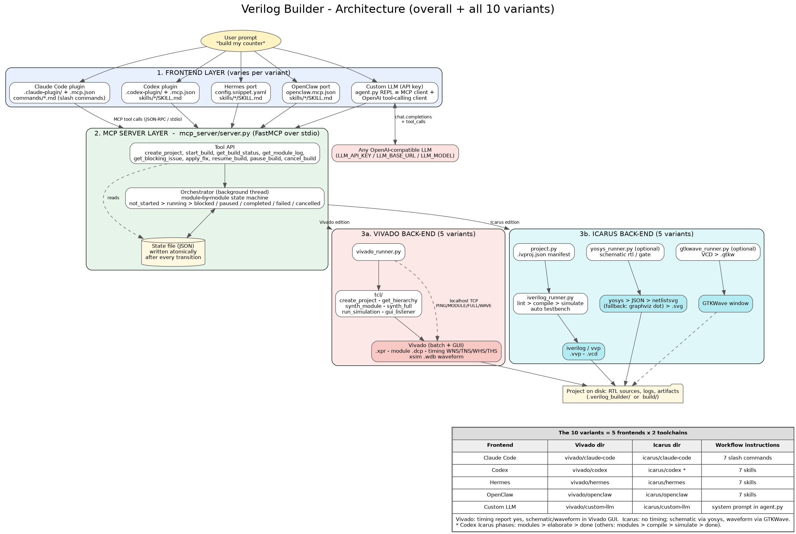

<p align="center">
  
</p>

<p align="center">
  
  
  
  
  
  
  
  
  <br>
  
  
  
  
  
  
</p>

<p align="center">
  
</p>

# Verilog Builder

Verilog Builder is a local FPGA workflow that lets an AI assistant create
projects, build designs module-by-module, stream synthesis progress, inspect
timing, pause safely for RTL changes, and generate simulation waveforms — all
by prompting, with no manual GUI steps.

## Editions

The same orchestration logic is packaged for three frontends:

- **[`vivado/claude-code/`](vivado/claude-code/README.md)** — the Claude Code plugin
  (and standalone MCP server) that started this project. Exposes the workflow
  as slash commands, and works from Claude Desktop too.
- **[`vivado/codex/`](vivado/codex/README.md)** — the Codex port, with its own
  MCP server, Tcl assets, and skills.
- **[`vivado/hermes/`](vivado/hermes/README.md)** and
  **[`vivado/openclaw/`](vivado/openclaw/README.md)** — Hermes Agent and OpenClaw
  ports (MCP server + skills).
- **[`vebu/`](vebu/README.md)** — a VS Code extension that talks to the same
  `mcp_server` orchestrator, for driving builds without leaving the editor.
- **Icarus Verilog edition** — the same workflow on a fully open-source
  toolchain, packaged for both frontends:
  [`icarus/claude-code/`](icarus/claude-code/README.md) and
  [`icarus/codex/`](icarus/codex/README.md), plus Hermes and OpenClaw ports in
  [`icarus/hermes/`](icarus/hermes/README.md) and
  [`icarus/openclaw/`](icarus/openclaw/README.md).

## What it does

- Creates a Vivado project from new or existing Verilog/SystemVerilog sources.
- Synthesizes modules one at a time, showing live module status and Vivado log output.
- Pauses on a synthesis error, presents the failing file and error, and resumes after a confirmed fix.
- Pauses at a safe module boundary when you want to change RTL during a running build.
- Reports WNS, TNS, WHS, and THS after a completed build.
- Runs behavioral simulation and opens the generated waveform in Vivado.

## Requirements

- Xilinx Vivado installed locally and available as `vivado` on your `PATH`, or
  configured through the `VIVADO_BIN` environment variable.
- Python 3 with the `mcp` package available to the selected MCP-server interpreter.

## Claude Code edition

Installed from [`vivado/claude-code/`](vivado/claude-code/), it exposes the workflow as
slash commands:

```text
/verilog-new
/verilog-build
/verilog-status
/verilog-timing
/verilog-fix
/verilog-modify
/generate_waveform
```

Its backend lives in [`vivado/claude-code/mcp_server/`](vivado/claude-code/mcp_server/)
and [`vivado/claude-code/tcl/`](vivado/claude-code/tcl/).

## Codex edition

The Codex plugin lives in [`vivado/codex/`](vivado/codex/). Its main components:

- [`vivado/codex/.vivado/codex/plugin.json`](vivado/codex/.vivado/codex/plugin.json) — plugin metadata.
- [`vivado/codex/.mcp.json`](vivado/codex/.mcp.json) — local MCP server configuration.
- [`vivado/codex/skills/`](vivado/codex/skills/) — seven assistant workflows:
  `verilog-new`, `verilog-build`, `verilog-status`, `verilog-timing`,
  `verilog-fix`, `verilog-modify`, and `generate-waveform`.
- [`vivado/codex/mcp_server/`](vivado/codex/mcp_server/) and
  [`vivado/codex/tcl/`](vivado/codex/tcl/) — the Vivado backend.

For an end-to-end example, see the [Codex walkthrough](vivado/codex/WALKTHROUGH.md).

## Icarus Verilog edition

A vendor-free port of the same product, for people without a Vivado licence. It
keeps the prompt-driven workflow — describe a module, get RTL on disk, build
module-by-module, pause-to-fix on errors — and swaps the toolchain:

| Job | Vivado edition | Icarus edition |
|---|---|---|
| Compile / elaborate | `vivado` synth | `iverilog` |
| Simulate | Vivado simulator | `vvp` |
| Schematic view | Open Elaborated Design | `yosys` + `netlistsvg` |
| Waveform view | Vivado waveform window | `.vcd` + `.gtkw` + GTKWave |
| Timing (WNS/TNS) | yes | no — nothing places or routes |

Requirements: `sudo apt install iverilog gtkwave yosys graphviz` plus
`sudo npm install -g netlistsvg`. No vendor tooling and no licence.

Both ports expose the same seven workflows — `iverilog-new`, `iverilog-build`,
`iverilog-status`, `iverilog-fix`, `iverilog-modify`, `iverilog-waveform`, and
`iverilog-schematic` — as slash commands in
[`icarus/claude-code/commands/`](icarus/claude-code/commands/) and as skills
in [`icarus/codex/skills/`](icarus/codex/skills/), backed by an
`iverilog-builder` MCP server in each port's `mcp_server/`.

Documentation:

- [Beginner tutorial](docs/icarus/beginner-tutorial.md) — install the toolchain
  and go from a prompt to a waveform and a schematic in one sitting.
- [Pipeline and flow diagrams](docs/icarus/pipeline.md) — what runs when, the
  build state machine, and the files a project accumulates.
- Port READMEs: [Claude Code](icarus/claude-code/README.md) ·
  [Codex](icarus/codex/README.md).

## Build lifecycle

1. Create or select a `.xpr` Vivado project.
2. Start a synthesis-only or full implementation build.
3. Watch each module progress from pending to running to complete.
4. Resolve any blocked module using a reviewed RTL fix, then resume.
5. Review timing and, when needed, generate a testbench waveform.

## Notes and limitations

- One build can run per project at a time.
- Module names are inferred from the Vivado compile order and assume roughly one module per RTL file.
- Full mode includes implementation and routing; synthesis mode is quicker and is the default for early feedback.
- Build state and logs are stored under the project's `.verilog_builder/` directory.
