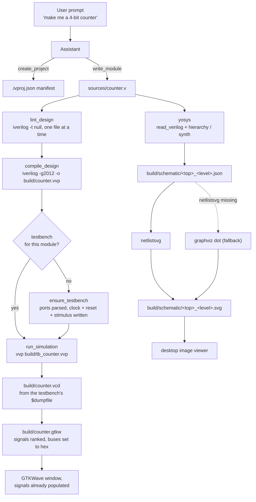
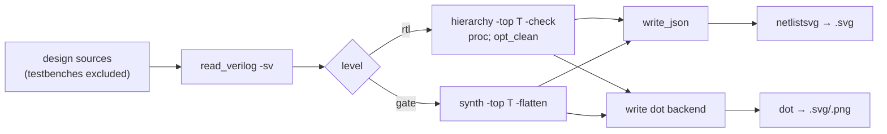
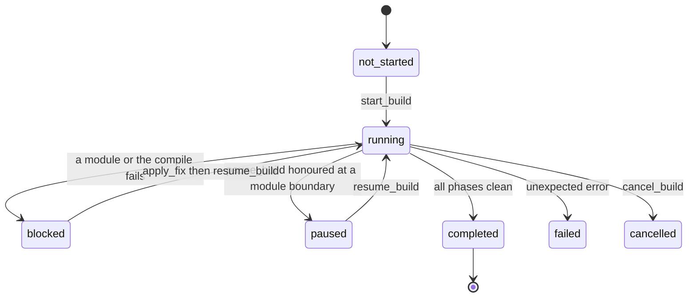
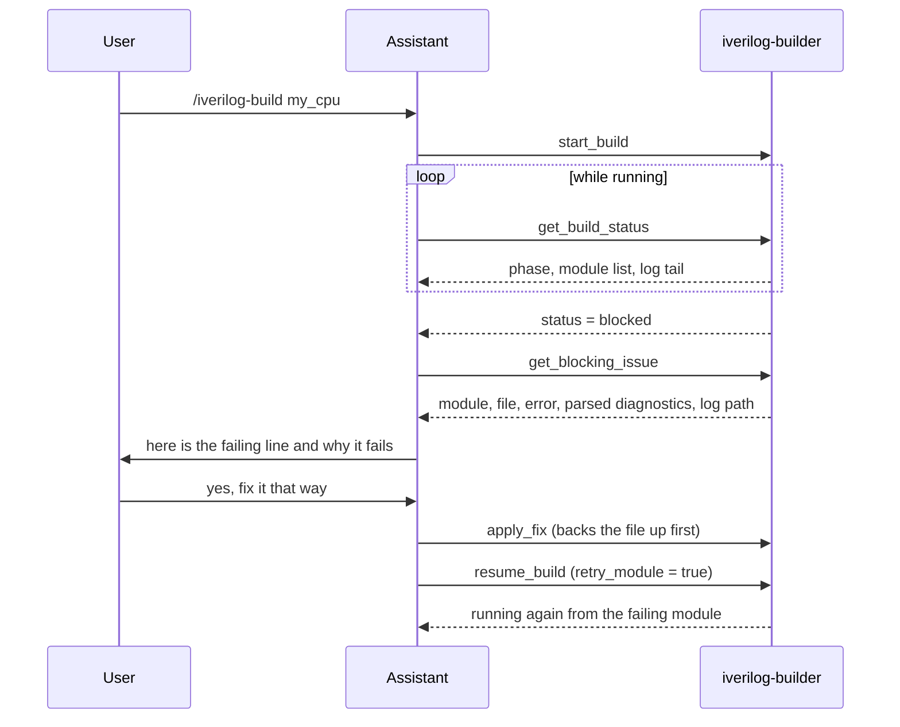

# The Icarus pipeline

How a sentence becomes a waveform and a schematic. Everything below is what the
plugin actually runs — no vendor tools, no GUI wizards.

## The whole picture



The two halves are independent. A schematic never needs a testbench, and a
waveform never needs yosys.

## The simulation path, step by step

1. **`write_module`** persists the Verilog and registers it in `.ivproj.json`.
   Nothing is written by hand, and no build script exists to edit.
2. **Lint** runs `iverilog` over each design file on its own, so a syntax error
   is attributed to the module that owns it rather than to the whole design.
3. **Compile** runs `iverilog -g<std>` across every registered source into a
   single `.vvp` binary under `build/`.
4. **Testbench.** If the module has no testbench, the plugin parses its port list
   — resolving parameterised widths — and writes one that instantiates the module
   by name, generates a clock if there is a clock-shaped port, pulses reset (with
   the right polarity for an `*_n` name), sweeps the inputs (exhaustively for a
   small combinational design, a clocked run otherwise), calls `$dumpfile` /
   `$dumpvars`, and **always calls `$finish`**.
5. **Simulate** runs `vvp` with its working directory set to `build/`, so a
   relative `$dumpfile` path lands there. The VCD path is read back out of the
   testbench's `$dumpfile(...)`, falling back to `build/dump.vcd`.
6. **`.gtkw`.** The VCD is parsed for every signal (scope, name, width), helper
   signals from the testbench are demoted, clocks and resets and top-level ports
   are ranked first, and multi-bit buses are flagged `@22` so GTKWave shows them
   in hex. Up to 40 signals go into the save file.
7. **View.** GTKWave is launched detached with both files, so the tool returns
   immediately and the window survives. With no `DISPLAY` it says so and hands
   back the paths instead of hanging.

## The schematic path



- **`level="rtl"`** stops after elaboration and light optimisation, so adders,
  multiplexers and registers survive as recognisable blocks. This is the view
  that corresponds to Vivado's *Open Elaborated Design*, and it is the one to
  look at first.
- **`level="gate"`** runs a full `synth`, **with `-flatten`**. The flatten is not
  cosmetic: without it, netlistsvg draws only the top module, so a hierarchical
  design (a 4-bit adder built from full adders, say) renders as a single opaque
  box with no gates in it at all. With it you see the actual gate netlist.
- Testbenches are deliberately excluded from the source list — a schematic of a
  stimulus generator is noise.
- Everything is kept: the generated `schematic.ys` script, the yosys JSON
  netlist, and the rendered image all sit in `build/schematic/`, so a render can
  be reproduced or re-styled without re-running the plugin.

## The build state machine

`start_build` returns immediately with a `build_id` and runs the work on a
background thread. State is persisted to `<build_dir>/.build_state.json` and
rewritten atomically after every transition, so any process can read it —
`get_build_status` is just a read of that file plus a 20-line tail of the log
that is being written right now.



Phases inside `running`:

- **Claude port:** `modules` → `compile` → `simulate` → `done`.
- **Codex port:** `modules` → `elaborate` → `done`.

Per-module status is `pending` → `running` → `done`, or `error`.

### The pause-to-fix loop

This is the point of the whole design: a failing build stops and waits for you
instead of dumping a wall of red.



`apply_fix` backs the original file up and appends to the state's `fix_log`, so
every prompt-driven edit is recoverable. `resume_build` with `retry_module=True`
resets the failing module to `pending` and restarts the orchestrator; with
`False` it leaves that module failed and moves on.

`pause_build` is cooperative — it sets `pause_requested`, which the orchestrator
honours *between* modules. It never kills an in-flight `iverilog` process, which
is why `/iverilog-modify` can safely change RTL mid-build.

## Files a project accumulates

```text
counter_demo/
  .ivproj.json                  name, top, sources, testbenches, build_dir, std,
                                include_dirs, created, resolved toolchain paths
  sources/counter.v             design RTL
  sources/tb_counter.v          generated testbench   (Claude port)
  tb/tb_counter.v               generated testbench   (Codex port)
  build/
    counter.vvp                 compiled design
    tb_counter.vvp              compiled testbench
    counter.vcd                 waveform dump
    counter.gtkw                GTKWave save file
    .build_state.json           the state machine above
    logs/
      counter.log               per-module lint output
      compile.log / elaborate.log
      simulate.log / tb_counter_sim.log
    schematic/
      schematic.ys              the generated yosys script
      counter_rtl.json          yosys netlist
      counter_rtl.svg           rendered schematic
      counter_gate.svg          gate-level render, if asked for
```

Paths in the manifest are stored relative to the project root where possible, so
a project directory can be moved or committed to git. `build/` is entirely
regenerable and is a reasonable thing to `.gitignore`.

## Where to go next

- [Beginner tutorial](beginner-tutorial.md) — zero to waveform in one sitting.
- [Claude Code port README](../../claude-plugin/icarus/README.md)
- [Codex port README](../../codex-plugin/icarus/README.md)
